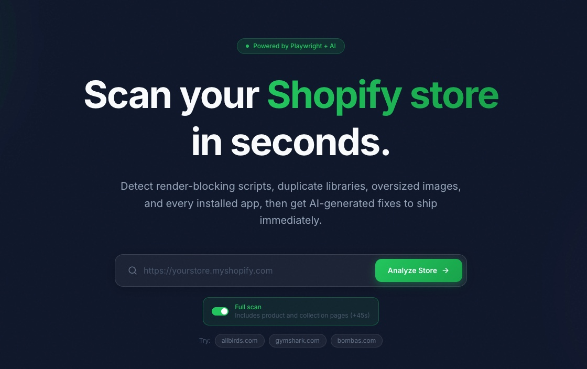
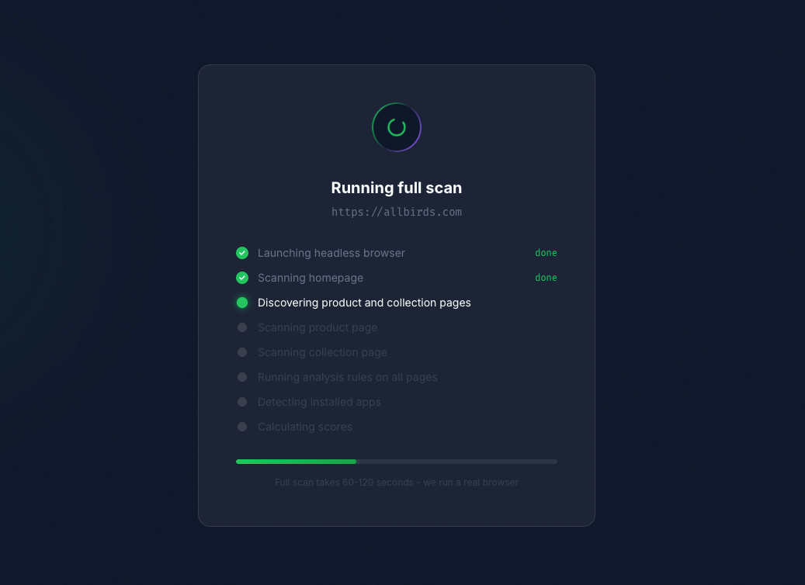
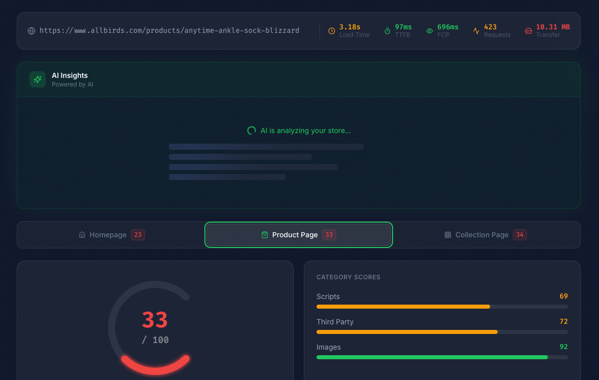
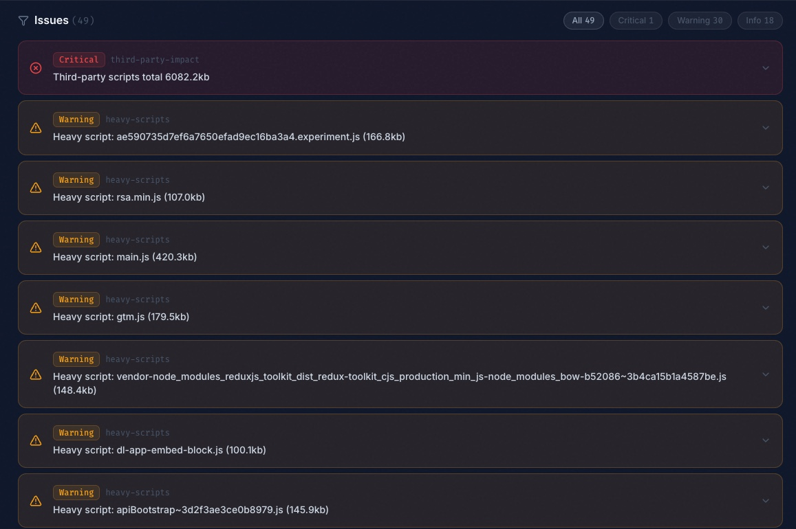
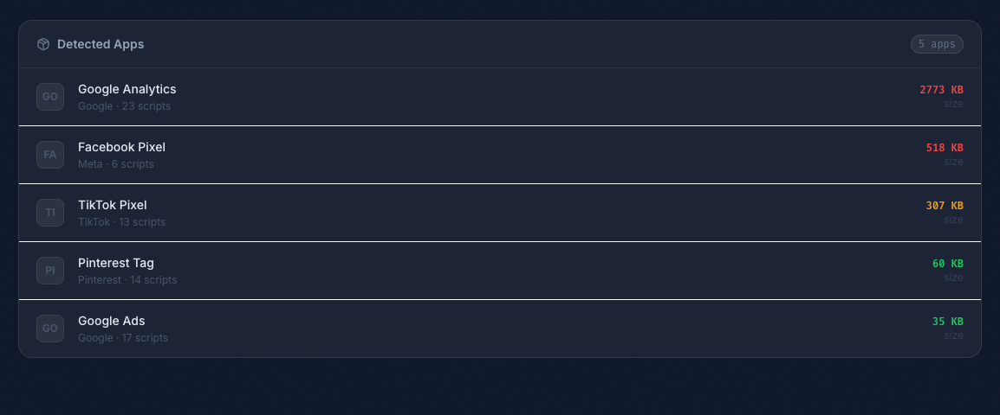

<p align="center">
  
</p>

<h1 align="center">Loadly</h1>

<p align="center">
  Analyze any Shopify storefront for performance issues in seconds.
</p>

---

Detects heavy scripts, duplicate libraries, render-blocking resources, unoptimized images, third-party bloat, and installed apps. Generates a 0-100 performance score with AI-powered fix recommendations.

<p align="center">
  
</p>

## Features

- **Core Web Vitals** - Measures TTFB, FCP, LCP, and CLS using the Performance API
- **Script Analysis** - Flags JavaScript files over 100KB, duplicate libraries, and render-blocking resources
- **Image Optimization** - Identifies oversized images and legacy formats (PNG, BMP, GIF)
- **Third-Party Impact** - Measures total weight of external scripts and detects missing preconnect hints
- **App Detection** - Fingerprints 48 known Shopify apps from network requests
- **Resource Hints** - Checks for missing `<link rel="preconnect">` and `<link rel="preload">`
- **AI Insights** - AI-generated fix recommendations with code snippets and priority ranking
- **Network Waterfall** - Visual timeline of every network request, color-coded by resource type
- **PDF Export** - Download a print-ready performance report
- **Multi-Page Scan** - Optionally scans product and collection pages for a full-site audit

## Screenshots

<p align="center">
  
  <br />
  <em>Full scan analyzing homepage, product, and collection pages</em>
</p>

<p align="center">
  
  <br />
  <em>Performance score, AI insights, category breakdown, and multi-page tabs</em>
</p>

<p align="center">
  
  <br />
  <em>Issues filtered by severity with expandable details</em>
</p>

<p align="center">
  
  <br />
  <em>Detected Shopify apps with request counts and transfer sizes</em>
</p>

## Web UI

```bash
cd web && npm install && npm run dev
```

Open http://localhost:3001, paste a Shopify URL, and get a full report with interactive charts, AI insights, and PDF export.

## CLI

```bash
# Quick scan
node dist/cli/index.js https://allbirds.com

# With options
node dist/cli/index.js https://gymshark.com --timeout 60000
node dist/cli/index.js https://bombas.com --json
```

### CLI Options

| Flag | Description |
|------|-------------|
| `--json` | Output raw JSON instead of formatted report |
| `--verbose` | Show detailed request information |
| `--timeout` | Navigation timeout in milliseconds (default: 30000) |

## Tech Stack

- **TypeScript** - Fully typed codebase
- **Playwright** - Headless Chromium for real browser analysis
- **Next.js 16** - Web dashboard with App Router
- **React 19** - Interactive UI with Framer Motion animations
- **Tailwind CSS 4** - Styling
- **Recharts** - Score visualizations
- **Vitest** - 81 unit tests across 15 test files

## How It Works

1. **Scrape** - Playwright loads the URL in headless Chromium, capturing every network response, head scripts, resource hints, and Core Web Vitals via the Performance API
2. **Analyze** - A rule engine runs 6 independent rules (heavy scripts, duplicate libraries, render-blocking, image optimization, third-party impact, resource hints)
3. **Detect** - Network requests are matched against a fingerprint database of 48 known Shopify apps
4. **Score** - Deductions by severity produce a 0-100 score across three categories (scripts, images, third-party)
5. **Report** - Results are formatted for CLI output, rendered in the web dashboard, or exported as PDF

See [docs/architecture.md](docs/architecture.md) for a deeper look at the system design.

## Project Structure

```
src/
  cli/           CLI entry point, formatter, spinner
  scraper/       Playwright page loading and network capture
  analyzer/      Rule engine and analysis rules
    rules/       Individual rule implementations
  detectors/     App detection from network fingerprints
  scoring/       Performance score calculation and grading
  types/         TypeScript interfaces
  utils/         Error types and shared helpers
web/
  app/           Next.js pages and API routes
  components/    React components (WaterfallChart, AIInsights, etc.)
data/
  appFingerprints.json    48 known Shopify app signatures
tests/
docs/
  architecture.md
```

## Development

```bash
# Install dependencies
npm install
cd web && npm install

# Build core (CLI + library)
npm run build:core

# Build everything (core + web)
npm run build

# Run tests
npm test

# Dev server (web UI)
npm run dev

# Lint & format
npm run lint
npm run format
```

## Adding a New Analysis Rule

1. Create a file in `src/analyzer/rules/` implementing the `AnalysisRule` interface
2. Register it in `src/analyzer/ruleRegistry.ts`
3. Map the rule ID to a scoring category in `src/scoring/scoreCalculator.ts`
4. Add tests in `tests/analyzer/rules/`

## Adding a New App Fingerprint

Edit `data/appFingerprints.json` and add an entry:

```json
{
  "appName": "App Name",
  "vendor": "Vendor",
  "domains": ["cdn.example.com", "api.example.com"]
}
```

## License

MIT
